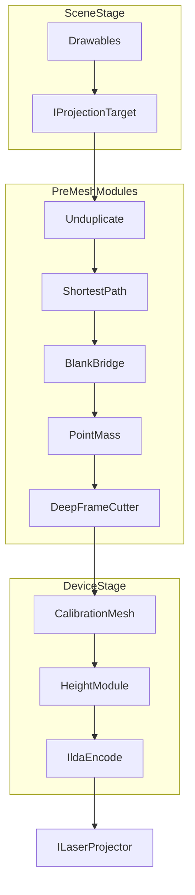

# Техническое задание: инженерная лазерная проекция (rewrite)

| Поле | Значение |
|------|----------|
| Документ | ТЗ на разработку продукта с нуля |
| Версия | 1.3 |
| Дата | 2026-09-07 |
| Статус | Черновик к согласованию |
| Продукт (имя в UI) | **2Cut** |
| Предшественник | 2CUT-Viewer (CadProjectorViewer + CadProjectorSDK) |
| Команда | 1 разработчик + AI-ассистент; жёсткого дедлайна нет |
| Ветка | Новая ветка rewrite; legacy WPF в этой ветке **заморожен** |

---

## 1. Паспорт ТЗ

### 1.1. Цель

Система должна обеспечить инженерную лазерную проекцию векторных чертежей на виртуальную плоскость или на STL-модель, совмещённую с реальной рабочей зоной, с выдачей кадра на лазерный проектор.

Система должна быть реализована как **rewrite** существующего 2CUT-Viewer: универсальное UI-agnostic ядро + клиент на Avalonia (Windows в v1).

### 1.2. Scope по этапам

#### MVP (первый deliverable — сейчас целимся сюда)

- 2D-проекция на виртуальную плоскость сцены.
- Импорт DXF, SVG (+ JSON проект/сцена); текст DXF **игнорируется**.
- Virtual projector + один VLT (железо в наличии).
- Модульный laser pipeline → ILDA → VLT.
- Калибровка mesh, виртуальная высота/Z, **одна прямоугольная маска**, базовый UI Avalonia (Windows, full-canvas).
- Цвет вывода: режим «один цвет сцены» **или** «цвет слоя».
- UDP **байт-совместимый** с legacy: load-by-path + play/stop/clear.
- Онлайн-лицензирование — **не в MVP** (этап после MVP).
- В ядре с дня 1: модель **позы проектора в пространстве** и контракт **распределения геометрии** (авто по FOV/pose).

#### После MVP: Legacy-parity

Полный функциональный паритет с замороженным 2CUT-Viewer по согласованному чеклисту (без STL). DWG, legacy `.2cfg`/`.2scn` import, расширенные модули, UX-паритет критичных сценариев.

#### После Legacy-parity: 3D / STL

- 3D viewport, STL как surface-target, alignment вручную или по 3–4 точкам.
- Мультипроекция (2+): распределение геометрии с учётом позы каждого проектора.
- Эталонные STL+DXF предоставляются заказчиком.

#### Позже

- STL-as-source; Linux/macOS UI (ядро portable с дня 1); GPU допускается в system requirements.

### 1.3. Out of scope текущего фокуса (MVP)

- STL / 3D viewport / project-on-mesh — **после** Legacy-parity.
- GCODE/NC, .glc.
- DxCeil (парсер/панель) — **исключён из проекта**.
- Текст из DXF/SVG как объекты.
- Полный паритет всех UDP-сценариев (сверх байт-совместимого load/play/stop/clear).
- Патч старого WPF как путь развития (в ветке rewrite — freeze).

### 1.4. Принятые решения заказчика (не пересматриваются)

1. Первый deliverable — **только MVP**; STL откладывается до полной реализации функционала Legacy.
2. Работа в **новой ветке**; старый код в ней заморожен.
3. Команда: 1 разработчик + нейросеть; строгого дедлайна нет.
4. Alignment STL (когда дойдём): вручную и/или по 3–4 точкам; эталоны STL будут.
5. Ориентация чертежа произвольная; у проекторов должна быть **характеристика положения в пространстве**; мультипроекция — любая плоскость установки.
6. Парк: Windows 10/11; запрос Mac/Linux учтён архитектурой; GPU можно требовать.
7. 2D часто 1 проектор; 3D — 2+; **механизм распределения геометрии между проекторами** закладывается сразу.
8. Один VLT доступен для отладки.
9. Лицензионный сервис — **после MVP**.
10. UDP — **байт-совместимый** формат с текущими потребителями (построители/MES).
11. Имя продукта — **2Cut**; ветка `rewrite/2cut`.
12. Цвет: настройка «единый цвет» / «цвет слоя».
13. Единицы: внутреннее хранение в **мм**; на импорте — конвертация из единиц файла.
14. Geometry split: **авто по FOV/позе** проектора.
15. Приёмка MVP: DXF → align → calibration → Play на VLT (3–5 мм).
16. Чеклист Legacy-parity — по экранам UI (см. §14.4); DxCeil исключён.
17. UI: **canvas + вкладки сцен на весь основной экран**; панели — всплывающие или поверх рабочей зоны.
18. MVP: **одна прямоугольная маска** на сцену.

### 1.5. Ключевые технические решения ТЗ (зафиксированы)

| Тема | Решение | Обоснование |
|------|---------|-------------|
| Порядок поставки | MVP (2D) → Legacy-parity → STL/3D → STL-as-source / Linux·macOS | Снижает риск; сначала рабочий лазер |
| Миграция legacy | Импорт `.2cfg`/`.2scn` → JSON; запись только новый формат | На этапе Legacy-parity |
| Формат проекта | Версионированный JSON (`.cproj` / `.cscene`) | Diff, кроссплатформа |
| MVP-форматы | MUST: DXF, SVG, JSON; SHOULD на parity: DWG; STL — этап 3D | Текст DXF вне scope |
| Единицы | Внутри мм; конвертация на импорте | Проще геометрия; все единицы файла поддерживаются через scale |
| Цвет лазера | Setting: SolidSceneColor \| LayerColor | Запрос заказчика |
| Поза проектора | Pose3D (позиция + ориентация) в модели устройства | Мультипроекция / произвольная установка |
| Multi-projector | Авто-split по FOV / Pose3D проектора | Решение заказчика |
| Проекция на STL (этап 3D) | Орто-проекция вдоль оси target (default −Z), луч + BVH | См. прежнее обоснование; ось/поза согласуются с Pose проекторов |
| UDP | Байт-совместимый load/play/stop/clear | MES/построители |
| VLT | `VLTLaserController.net` | Есть железо |
| Лицензии | **После MVP**; в MVP — без обязательного license-сервиса | Снижение scope первого deliverable |
| Multi-projector split | Автоматически по полю зрения / позе проектора | Заказчик: вариант 2 |
| Ветка | `rewrite/2cut` | Решение заказчика |
| Solution | `2Cut.sln` → `src/*` | Sprint 0 каркас |
| UI layout | Canvas + scene tabs = full main area; panels = flyout/overlay/popup | Заказчик: не 3 колонки legacy |
| DxCeil | Исключён | Решение заказчика |

---

## 2. Термины и определения

| Термин | Определение |
|--------|-------------|
| **Ядро** | Набор сборок без UI-зависимостей: сцена, геометрия, рендер, устройства, файлы |
| **Сцена** | Рабочее пространство: объекты, target (плоскость или STL), маски, привязка проекторов |
| **Drawable** | Векторный объект сцены (контуры, группы; текст CAD в MVP не импортируется) |
| **Projection target** | Получатель проекции: `PlaneTarget` или `MeshTarget` (STL) |
| **Alignment** | Совмещение виртуальной геометрии (плоскость/STL) с реальной зоной |
| **Calibration mesh** | Сетка деформации кадра проектора (perspective/морф) |
| **Render frame** | Нормализованный набор линий/точек до ILDA |
| **ILDA frame** | Кадр формата ILDA для DAC/контроллера |
| **Device module** | Модуль pipeline (blanking, shortest path, Z, project-on-mesh, …) |
| **Virtual raise/lower** | Смещение по Z / имитация высоты относительно target |
| **Projector pose** | Положение и ориентация проектора в пространстве сцены (для мультипроекции) |
| **Geometry split** | Назначение частей геометрии конкретному проектору по зоне/видимости/правилам |

---

## 3. Контекст и стейкхолдеры

### 3.1. As-is (кратко)

Текущий 2CUT-Viewer: WPF/.NET 10. Пайплайн:

`CAD → ToGeometryConverter (WPF Geometry) → CadObjects → ProjectionScene → DeviceModules/Mesh → ILDA → VLT → лазер`

«3D» = Z + `ZCorrector`/`DeepFrameCutter`, не STL-сцена. `CadProjectorSDK` зависит от WPF — главный блокер portable-ядра.

### 3.2. Стейкхолдеры

| Роль | Интерес |
|------|---------|
| Оператор станка | Быстро открыть чертёж, совместить, включить лазер |
| Технолог | Точность на плоскости и на оснастке (STL), маски, высота |
| Интегратор | UDP-автоматизация, стабильный протокол кадров |
| Разработчик | Тестируемое ядро, Avalonia UI, расширяемые драйверы/форматы |

### 3.3. To-be поток

---

## 4. Общее описание продукта и режимов

### 4.1. Режим 2D Plane

Система должна позволять размещать drawable на прямоугольной плоскости сцены заданного размера, применять трансформы, маски, alignment и отдавать контуры в laser pipeline. Поведение не хуже текущего 2CUT-Viewer по базовым сценариям open → place → play.

### 4.2. Режим 3D Mesh (STL target)

Система должна:

1. Загружать STL как `MeshTarget`.
2. Отображать mesh + чертежи в 3D viewport.
3. Совмещать mesh с рабочей зоной (трансформ alignment).
4. Проецировать контуры чертежа **на поверхность** mesh (см. §7.D).
5. Передавать результат (3D-полилинии → проекция в пространство устройства) в тот же laser pipeline.

### 4.3. Совместное использование

Сцена должна иметь ровно один активный projection target: либо плоскость, либо STL. Переключение target пересчитывает проекцию. 2D UI-манипуляции чертежа сохраняются; в 3D-режиме дополнительно доступны орбита/pan/zoom камеры просмотра (не путать с калибровкой лазера).

---

## 5. Архитектура и принципы

### 5.1. Принципы

1. **UI-agnostic core** — ядро не ссылается на WPF/Avalonia/WinForms/`System.Windows.*`.
2. **Thin UI** — Avalonia только презентация, команды, биндинги.
3. **Один ILDA-стек** в ядре.
4. **Драйверы за интерфейсом** `ILaserProjector`.
5. **Модульный pipeline** — порядок модулей конфигурируем, каждый модуль чистая трансформация `LinesCollection`.
6. **Latest-frame wins** — к устройству уходит последний готовый кадр, без очереди устаревших.
7. **Тесты без UI** — доменная логика покрывается unit-тестами.

### 5.2. Сборки (границы)

| Сборка | TFM | Назначение |
|--------|-----|------------|
| `CadProjector.Geometry` | net10.0 | Point2/3, Matrix, Path, Polyline, TriangleMesh, пересечения лучей |
| `CadProjector.Core` | net10.0 | Project, Scene, Drawable, Transform, Hub, доменные события |
| `CadProjector.FileFormats` | net10.0 | Импорт DXF/SVG/DWG/STL; импорт legacy; JSON проект |
| `CadProjector.Rendering` | net10.0 | Тесселяция, ProjectOnTarget, device modules, RenderFrame |
| `CadProjector.Ilda` | net10.0 | IldaPoint/Frame read-write |
| `CadProjector.Devices` | net10.0 | ILaserProjector, Virtual, VLT-адаптер (→ VLTLaserController.net) |
| `CadProjector.Automation` | net10.0 | UDP/TCP host, очередь задач |
| `CadProjector.App` | net10.0-windows | Avalonia UI |

Запрещено в ядре: `Dispatcher`, `FrameworkElement`, `PathGeometry`, WPF `ObservableCollection` как единственный канал наблюдения. Допустимы события, `INotifyPropertyChanged`, собственные коллекции.

### 5.3. As-is → To-be

| Legacy | Решение |
|--------|---------|
| `VLTLaserController.net` | **Переиспользовать** |
| Идеи `CadProjector.Core/FileFormats/Rendering/Devices` | **Переписать/завершить** как источник границ модулей |
| Поведение `ProjectionScene`, modules, mesh, ZCorrector | **Переписать** поведенчески |
| `ToGeometryConverter` | **Не переносить**; парсеры в `FileFormats` без WPF |
| WPF UI Viewer, `CanvasObject` | **Выкинуть** |
| Дубли ILDA (SDK + ILDA.net) | **Один** стек в `CadProjector.Ilda` |
| `ToCutRender` | **Не подключать**; логика в `Rendering` |

**Legacy-фичи MUST в v1:** open DXF/SVG, сцена/размер, маски, play/stop, mesh calibration, Z raise/lower, VLT output, virtual preview, UDP load-by-path (базовый).

**SHOULD:** DWG, multi-device.

**COULD:** экспорт .ild, advanced mesh tools UI.

**Исключено из планов:** GCODE/NC, .glc (Arculator).

---

## 6. Модель данных

### 6.1. Сущности

- **Hub** — Projectors[], Scenes[], AutomationHost, License, Settings.
- **Project** — метаданные, путь, список SceneRef, единицы, версия схемы.
- **Scene** — Drawables, Target (`PlaneTarget` | `MeshTarget`), Masks, Bound projectors, PlayState.
- **Drawable** — Id, Name, Geometry (paths), LocalTransform (T/R/S + Z), Color/Layer, Visible, Locked, Group children.
- **PlaneTarget** — Width, Height, Origin, Transform.
- **MeshTarget** — TriangleMesh (из STL), AlignmentTransform, ProjectionAxis (default −Z).
- **Projector** — DeviceId, Size, CalibrationMesh, Modules[], Connection, ProjectionSettings (RGB, PointStep).
- **CalibrationMesh** — control points, mode (perspective/morph).
- **RenderFrame / LinesCollection / RenderPoint** — промежуточный кадр.
- **IldaFrame** — выход на устройство.
- **DeviceModule** — Id, Enabled, Parameters, `Apply(lines)→lines`.
- **SceneTask** — задача загрузки/показа из UI или automation.

### 6.2. Контракты расширения

- `IFileImporter` — `CanRead(ext)`, `Import(stream)→ImportResult`.
- `ILaserProjector` — Connect/Disconnect, SendFrame, Play/Stop, Info.
- `IDeviceModule` — Apply + metadata для UI.
- `IProjectionTarget` — `Project(polylines)→polylines3D` / device-space lines.

---

## 7. Функциональные требования

Приоритеты: **MUST** / **SHOULD** / **COULD**. Для каждой области — критерии приёмки.

### 7.A. Управление проектом / сценой

**Цель:** создать/открыть/сохранить проект, управлять объектами сцены.

| ID | Требование | Pri |
|----|------------|-----|
| A1 | Система должна создавать пустой проект с одной сценой и PlaneTarget по умолчанию | MUST |
| A2 | Система должна сохранять/загружать проект в версионированном JSON | MUST |
| A3 | Система должна поддерживать дерево объектов: select, rename, group, visibility, lock | MUST |
| A4 | Система должна поддерживать Undo/Redo базовых трансформов и add/remove | SHOULD |
| A5 | Система должна предупреждать о несохранённых изменениях при закрытии | MUST |

**Non-goals:** облачная синхронизация проектов.

**Приёмка:** round-trip JSON проекта с ≥10 drawable и маской без потери геометрии (допуск 1e-6 от единиц файла).

### 7.B. Импорт файлов

| ID | Требование | Pri |
|----|------------|-----|
| B1 | Импорт DXF → drawable paths | MUST |
| B2 | Импорт SVG → drawable paths | MUST |
| B3 | Импорт STL (binary + ASCII) → MeshTarget | MUST |
| B4 | Импорт DWG | SHOULD |
| B5 | Импорт legacy `.2scn` и `.2cfg` (см. §11) | MUST |
| B6 | Прогресс и ошибки импорта с понятным сообщением | MUST |
| B7 | .ild import | COULD |

**MVP-форматы (зафиксировано):** MUST = DXF, SVG, STL, JSON-проект; SHOULD = DWG. **Вне scope:** GCODE/NC, .glc.

**Приёмка:** набор эталонных файлов (минимум по 3 на MUST-формат) открывается без UI-crash; STL 500k треугольников загружается с индикатором прогресса.

### 7.C. 2D-режим

| ID | Требование | Pri |
|----|------------|-----|
| C1 | Размер плоскости сцены задаётся пользователем | MUST |
| C2 | Трансформы drawable: translate X/Y/Z, rotate, scale, якоря attach | MUST |
| C3 | Маски (`CadRect`-аналог) обрезают контуры до pipeline | MUST |
| C4 | Выравнивание объекта относительно сцены (center/edges) | MUST |
| C5 | Отображение 2D canvas с zoom/pan | MUST |

**Приёмка:** сценарий legacy «открыл DXF → выровнял → play» воспроизводится на virtual projector.

### 7.D. 3D-режим v1 (STL target)

**Метод проекции (зафиксирован): ортогональная проекция вдоль оси target −Z.**

Алгоритм:

1. Drawable тесселируется в полилинии в пространстве сцены.
2. Для каждой точки строится луч параллельно −Z_target (или заданной ProjectionAxis).
3. Ищется ближайшее пересечение с front-facing треугольником mesh (с acceleration structure: BVH).
4. При отсутствии hit — точка отбрасывается или сегмент рвётся (конфигурируемо; default: break segment).
5. Полученные 3D-точки образуют полилинии на поверхности; далее — проекция в device space через калибровку сцены/проектора.

**Почему не UV / nearest-vertex:** для инженерной оснастки важен чертёж «сверху»; UV у STL обычно нет; nearest-vertex даёт ступенчатость.

| ID | Требование | Pri |
|----|------------|-----|
| D1 | Загрузка STL как MeshTarget | MUST |
| D2 | 3D viewport: orbit/pan/zoom, отображение mesh + paths | MUST |
| D3 | Alignment transform mesh (T/R/S) | MUST |
| D4 | Ортогональная проекция чертежа на mesh по §7.D | MUST |
| D5 | Переключение Plane ↔ Mesh target с пересчётом | MUST |
| D6 | BVH/ускорение для STL до лимита §7.K | MUST |
| D7 | Визуализация hit-miss (опциональная подсветка) | SHOULD |

**Non-goals v1:** проекция рёбер самого STL на лазер; boolean; editing mesh.

**Приёмка:** на эталонном STL + прямоугольнике 100×50 результат hit-точек лежит на поверхности (отклонение ≤ толщины тесселяции); кадр уходит на virtual projector.

### 7.E. Виртуальная высота / Z

| ID | Требование | Pri |
|----|------------|-----|
| E1 | Drawable.MZ (OffsetZ) влияет на 2D plane mode через модули height (аналог ZCorrector) | MUST |
| E2 | В Mesh mode OffsetZ интерпретируется как смещение вдоль нормали/оси проекции **до** ray-cast (подъём чертежа над/под номинальной плоскостью проекции) | MUST |
| E3 | Модуль **DeepFrameCutter** (наследник legacy `DeepFrameCutter`): обрезка/коррекция кадра по глубине и рамке (X/Y/Width/Height, center, IgnoreHeight) | MUST |
| E4 | Deep clipping / IgnoreHeight — настраиваемые параметры модуля | SHOULD |

**Приёмка:** при Z≠0 на plane визуально и в кадре масштабирование/сдвиг согласованы с документированной формулой модуля; DeepFrameCutter на эталонной сцене даёт паритет с legacy; на mesh — стабильный пересчёт без crash.

### 7.F. Калибровка и multi-device

| ID | Требование | Pri |
|----|------------|-----|
| F1 | Calibration mesh на проектор (точки, perspective/morph) | MUST |
| F2 | Сохранение калибровки в проекте/профиле устройства | MUST |
| F3 | Модель multi-projector + Pose3D + интерфейс geometry split (MVP: ≥1 устройство; split-логика тестируется unit-тестами даже на 1 устройстве) | MUST |
| F3b | UI/эксплуатация 2+ проекторов в 2D | SHOULD (MVP может ограничиться 1 в UI) |
| F3c | Боевое использование 2+ на 3D/STL | MUST на этапе 3D |
| F4 | Мастер калибровки (dot/rect/grid) в UI | MUST |

**Приёмка:** после калибровки тестовый прямоугольник совпадает с физической меткой в пределах **3–5 мм** (конкретный допуск фиксируется в тест-плане площадки; зависит от условий).

### 7.G. Laser pipeline → ILDA → устройство

| ID | Требование | Pri |
|----|------------|-----|
| G1 | Pipeline: scene project → pre-mesh modules → calibration mesh → ILDA | MUST |
| G2 | Модули: unduplicate, shortest path, blank bridge, point mass, scan-rate, **DeepFrameCutter**, height/ZCorrector (минимум как в legacy) | MUST |
| G3 | Project-on-mesh как модуль/стадия до device proportions | MUST |
| G4 | VLT send через VLTLaserController.net | MUST |
| G5 | VirtualProjector preview | MUST |
| G6 | Latest-frame wins | MUST |
| G7 | Экспорт .ild | COULD |

**Приёмка:** play на Virtual и на VLT (при наличии железа) без утечки кадров старше текущего; stop гасит вывод.

### 7.H. Автоматизация

| ID | Требование | Pri |
|----|------------|-----|
| H1 | UDP listener: load/play/stop/clear в **байт-совместимом** формате с legacy | MUST |
| H2 | Очередь SceneTask | MUST |
| H3 | Документированный протокол команд (версия) | MUST |
| H4 | Расширенные UDP/TCP-сценарии | COULD (после v1) |

**Приёмка:** внешний скрипт отправляет UDP «открыть файл + play» → virtual projector показывает кадр ≤ 3 с на эталонном DXF.

### 7.I. UI Avalonia (Windows)

| ID | Требование | Pri |
|----|------------|-----|
| I1 | Canvas + вкладки сцен занимают **весь основной экран** | MUST |
| I2 | Панели (дерево, устройства, трансформы, логи, настройки) — **всплывающие / overlay поверх** рабочей зоны, не постоянные боковые колонки | MUST |
| I3 | Критичные команды Open / Play / Stop доступны без открытия панелей (toolbar/chrome) | MUST |
| I4 | Диалоги: калибровка, настройки устройства, модули | MUST (состав по §14.4) |
| I5 | RU/EN ресурсы | MUST |
| I6 | Переключение 2D / 3D viewport | MUST на этапе 3D; в MVP — только 2D |

**Приёмка:** сценарий MVP выполняется, при этом ≥70% площади клиентской области занимает canvas.

### 7.J. Персистентность

| ID | Требование | Pri |
|----|------------|-----|
| J1 | JSON project/scene schema с полем `schemaVersion` | MUST |
| J2 | User settings (work folder, UDP port, language, DXF units) | MUST |
| J3 | Миграция schemaVersion N→N+1 | MUST |
| J4 | Импорт legacy (§11) | MUST |

### 7.K. Производительность и лимиты

| Параметр | v1 target |
|----------|-----------|
| STL треугольников | до 1e6 интерактивно; предупреждение >500k |
| Частота обновления кадра pipeline | ≥ 15 Hz на типичной сцене (≤50k сегментов) |
| Тесселяция кривых | задаваемый PointStep (как legacy) |
| UI freeze при импорте | запрещён; только фон + прогресс |

### 7.L. Безопасность лазера

| ID | Требование | Pri |
|----|------------|-----|
| L1 | Явный Play/Stop; Stop доступен всегда | MUST |
| L2 | При потере связи — попытка safe stop / индикация | MUST |
| L3 | Предупреждение при первом Play сессии | SHOULD |

### 7.M. Этапность

| Этап | Содержание | Критерий выхода |
|------|------------|-----------------|
| **MVP** | Ядро + 2D full-canvas UI + DXF/SVG + Virtual/VLT + JSON + UDP byte-compat + Pose/Split-контракты | DXF → align → calibration → Play VLT (3–5 мм) |
| **Legacy-parity** | Чеклист §14.4 (P) + DWG + import `.2cfg`/`.2scn` | Все P закрыты |
| **3D / STL** | Viewport, STL target, alignment, multi-projector FOV split | Эталоны заказчика |
| **Later** | License service; STL-as-source; Linux/macOS UI | Отдельные мини-ТЗ |

---

## 8. Нефункциональные требования

| ID | Требование |
|----|------------|
| NFR1 | Ядро собирается на `net10.0` без Windows-TFM |
| NFR2 | Unit-тесты Geometry/Rendering/FileFormats в CI |
| NFR3 | Логи: уровни, файл + UI sink; без секретов лицензии в open log |
| NFR4 | Расширение формата = новый `IFileImporter` без правки ядра сцены |
| NFR5 | Расширение устройства = новый `ILaserProjector` |
| NFR6 | Качество STL-проекции: документированный допуск; детерминизм на одном BVH |
| NFR7 | UI v1 тестируется на Windows 10/11 x64 |

---

## 9. Протоколы и интеграции

### 9.1. VLT

Система должна использовать `VLTLaserController.net` (команды LINK/PLAY/SCAN/цвета/FLIP, `SendFrame`). Адаптер в `CadProjector.Devices` конвертирует `IldaFrame` → bytes.

### 9.2. ILDA

Один модуль `CadProjector.Ilda`: точки, blanking, palette/RGB по settings проектора, resolution под VLT (как в legacy ±65533).

### 9.3. UDP Automation

Документ протокола MVP: **байт-совместимый** с текущим legacy UDP для команд load-by-path, clear, play, stop (потребители: построители/MES). Расширение сценариев — после MVP/parity. Breaking changes — только с новой версией заголовка.

### 9.4. Файлы

| Формат | Роль |
|--------|------|
| `.cproj` JSON | Проект |
| `.cscene` JSON | Сцена (может быть embedded) |
| `.2cfg` / `.2scn` | Только импорт |
| DXF/SVG/DWG/STL | Контент |

### 9.5. Лицензирование

**После MVP.** Онлайн-сервис регистрации/учёта ключей + офлайн-активация. В MVP лицензия не блокирует разработку и приёмку Play на VLT. Детали — отдельный документ `TZ-LicenseService` на этапе после MVP.

---

## 10. UI/UX требования (Avalonia, Windows)

1. **Главный принцип:** canvas + вкладки сцен занимают весь основной экран. Все остальные панели — flyout, overlay или отдельные окна поверх рабочей зоны (не layout из трёх постоянных колонок legacy).
2. Тонкий chrome: меню / toolbar с Open, Play, Stop, вызовами панелей.
3. 3D viewport (этап 3D) не заменяет калибровку лазера: отдельный диалог.
4. Stop визуально приоритетен относительно Play.
5. Локализация RU/EN.
6. DxCeil UI/логика не переносятся.

---

## 11. Миграция с 2CUT-Viewer

### 11.1. Решение (зафиксировано): **импорт без обратной записи**

- Система должна читать `.2cfg` (устройства, mesh, модули, ключи — по возможности) и `.2scn` (объекты/сцена).
- Система должна создавать новый JSON-проект; **не** перезаписывать `.2cfg`/`.2scn` нативными средствами.
- Неподдерживаемые куски legacy → warning в лог + отчёт миграции (что перенесено / что нет).

### 11.2. Обязательный перенос

Устройства VLT (host/port), calibration mesh, размер сцены, объекты геометрии, MZ/scale/rotate где парсится однозначно, базовые module flags.

### 11.3. Лучшее усилие / опционально

Редкие модули, hybrid XML edge-cases, лицензионные ключи (если формат позволяет — MUST попытаться).

### 11.4. Приёмка миграции

≥5 реальных `.2scn` и ≥2 `.2cfg` от заказчика: открываются; визуальный diff с legacy на virtual — согласован технологом.

---

## 12. Этапы поставки и критерии приёмки

| Этап | Deliverable | Exit criteria |
|------|-------------|---------------|
| E0 | Репозиторий solution, пустые сборки, CI build | Green build core |
| E1 | Geometry + DXF/SVG import + Scene 2D + Virtual | MVP §7.M |
| E2 | Pipeline modules + ILDA + calibration | Кадр на virtual = эталон |
| E3 | VLT adapter | Play на железе |
| E4 | STL + ortho project-on-mesh + 3D viewport | §7.D приёмка |
| E5 | Legacy import + UDP base + localization + online license client | v1 complete |

Общий критерий v1: все MUST из §7 выполнены; SHOULD — согласованный % (целевой ≥70% SHOULD).

---

## 13. Риски и решения заказчика

### 13.1. Риски

| Риск | Митигация |
|------|-----------|
| Большие STL тормозят raycast | BVH + лимиты + downsample warning |
| Неполный парсинг legacy XML | Отчёт миграции; ручной донастрой |
| DWG-зависимость тяжёлая | SHOULD; fallback «экспорт в DXF» в документации |
| Паритет Z-формулы с legacy | Эталонные тесты vs старый ZCorrector |

### 13.2. Закрытые вопросы заказчика

| # | Вопрос | Решение |
|---|--------|---------|
| 1 | Допуск калибровки F4 | **3–5 мм**, зависит от условий площадки |
| 2 | Паритет UDP-сценариев | Не полный; **байт-совместимые** load/play/stop/clear |
| 3 | Лицензирование | Онлайн + офлайн; **после MVP** |
| 4 | Бренд / ветка | **2Cut** / `rewrite/2cut` |
| 5 | Первый deliverable | **MVP only**; STL после Legacy-parity |
| 6 | Multi-projector | Split **авто по FOV/pose**; контракт с MVP |
| 7 | Текст CAD | Игнорировать на импорте |
| 8 | Цвет | Настройка: единый цвет / цвет слоя |
| 9 | Единицы | Внутри мм + конвертация на импорте |
| 10 | Приёмка MVP | DXF → align → calibration → Play VLT (3–5 мм) |
| 11 | Legacy-parity чеклист | Согласован (§14.4); DxCeil = X |
| 12 | UI layout | Full-screen canvas; панели overlay/popup |
| 13 | Маска MVP | Одна прямоугольная маска |

*Также зафиксировано:* STL орто −Z; legacy import-only; без GCODE/.glc/DxCeil — см. §1.5 / §14.4.

---

## 14. Приложения

### 14.1. Глоссарий форматов

| Ext | Назначение | v1 |
|-----|------------|----|
| dxf | Векторный чертёж | MUST |
| svg | Векторный чертёж | MUST |
| stl | Mesh target | MUST |
| cproj/cscene | Проект/сцена JSON | MUST |
| dwg | Векторный чертёж | SHOULD |
| 2cfg/2scn | Legacy import | MUST import |
| ild | ILDA file | COULD |

**Исключены из планов:** gcode/nc, glc (Arculator), DxCeil.

### 14.2. Диаграмма модулей pipeline

### 14.3. Справка as-is классов (поведение)

Ориентиры поведения (не API to-be): `ProjectorHub`, `ProjectionScene`, `UidObject`/`CadGeometry`, `ObjectConverter`, `LProjector`, `RenderFrame`, `ProjectorMesh`, `ZCorrector`, `DeepFrameCutter`, `LFrameConverter`, `VLTLaserProjector`, `FileLoad`, `MWS`, `SaveScene`.

### 14.4. Чеклист UI: MVP (M) / Legacy-parity (P) / Later (L) / Exclude (X)

Согласовано с заказчиком (рекомендации аналитика + исключения).

| # | Поверхность (legacy) | Этап | Примечание |
|---|----------------------|------|------------|
| 1 | MainWindow shell, меню Файл, Open/Save, Play | **M** | Canvas на весь экран (§10) |
| 2 | Progress | **M** | Overlay/снизу |
| 3 | Tray + карточки устройств | **P** | |
| 4 | Лицензия UI | **L** | После MVP |
| 5 | Язык / kill other process | **P** / **X** | Язык = P; kill = X |
| 6 | Canvas + вкладки сцен | **M** | Full main area |
| 7 | FrameTree | **M** | Overlay/flyout |
| 8 | Лента контуров (ScrollPanel) | **P** | Overlay |
| 9 | CadObjectPanel (трансформы) | **M** | Overlay |
| 10 | Clear / Line / Mask | **M** / **P** | MVP: **одна прямоугольная маска**; Clear/Line = P |
| 11 | Play | **M** | Toolbar |
| 12 | DeviceTab | **M** | Overlay |
| 13 | Add device by IP | **M** | Диалог |
| 14 | CreateGrid / Meshes | **M** | Для приёмки VLT |
| 15 | Device settings + Modules editor | **P** | В MVP минимум Z + DeepFrameCutter без полного редактора |
| 16 | DeviceTree Admin | **P** | |
| 17 | ProjectorView / LaserMeter | **X** / **P** | LaserMeter = X; ProjectorView = P optional |
| 18 | Open DXF/SVG | **M** | |
| 19 | Save/Load JSON-проекта; legacy `.2cfg`/`.2scn` | **M** / **P** | JSON = M; legacy import = P |
| 20 | Save/Open scene отдельно | **P** | |
| 21 | WorkFolder | **P** | |
| 22 | ILDA export | **P** | |
| 23 | DxCeil | **X** | Исключён из проекта |
| 24 | UDP toggle + settings | **M** | Байт-совместимый минимум |
| 25 | HubPage | **P** | |
| 26 | Manipulator TCP | **P** | |
| 27 | Scene size / App defaults | **M** | |
| 28 | Log panel | **P** | Overlay |
| 29 | Admin-only вкладки | **P** | |

---

*Конец документа ТЗ v1.2*
